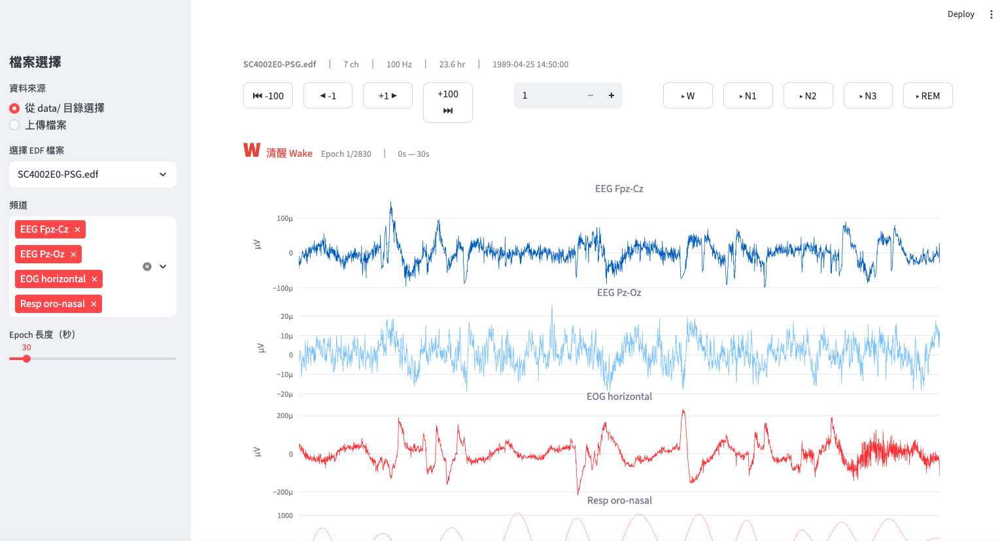
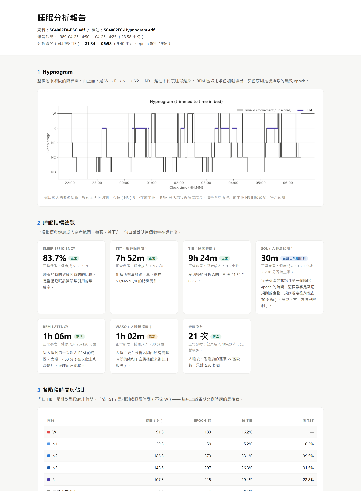
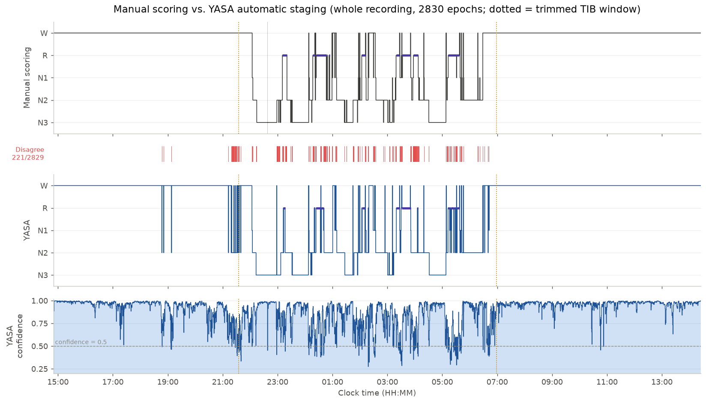
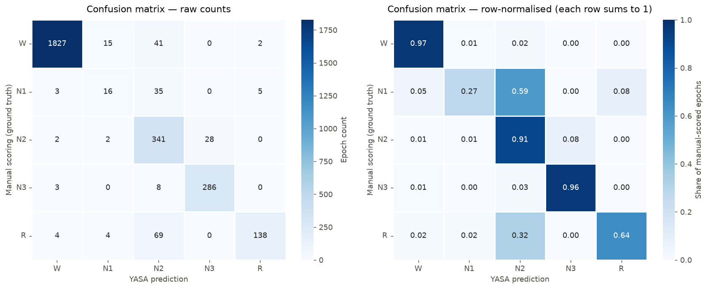

# EDF Viewer —— Sleep-EDF 多導睡眠圖瀏覽與分析

這是一套針對多導睡眠圖（PSG，polysomnography）的瀏覽與分析工具，用
Streamlit + MNE + Plotly + YASA 實作，分成三個部分：

1. **波形瀏覽器**（互動網頁）—— 把 `.edf` 檔切成 30 秒 epoch，逐段翻看
   EEG / EOG / 呼吸 / 肌電等原始訊號，並同步顯示該段的人工睡眠分期標註，
   可一鍵跳到下一個 W / N1 / N2 / N3 / REM。
2. **睡眠報告**（離線腳本 → 自包含 HTML）—— 從人工標註算出整夜 hypnogram、
   七項臨床睡眠指標（睡眠效率、TST、SOL、REM latency、WASO、覺醒次數、階段佔比），
   以及各睡眠階段的 EEG 功率頻譜與相對頻帶功率。
3. **自動分期比對**（離線腳本 → 圖表）—— 用 YASA 對同一份訊號做自動睡眠分期，
   跟人工標註逐 epoch 比對，產出 accuracy、Cohen's kappa、混淆矩陣與各階段 F1。

測試資料是 PhysioNet 公開資料集
[Sleep-EDF Database Expanded](https://physionet.org/content/sleep-edfx/)
的受試者 SC4002（1989-04-25 錄製，23.6 小時，7 頻道，100 Hz，2830 個 epoch）。

## 成果截圖

### 1. 波形瀏覽器



左側選檔與頻道、上方導覽列翻頁與跳階段，標題列即時顯示目前 epoch 的睡眠階段。

### 2. 睡眠報告



整夜 hypnogram（已裁切出躺床區間 21:34–06:58）、七項指標卡片（各附健康成人參考範圍）、
各階段時間與佔比。完整報告見
[`report/sleep_report.html`](report/sleep_report.html)（單一自包含檔案，下載後直接用瀏覽器開啟；
線上預覽：[htmlpreview](https://htmlpreview.github.io/?https://github.com/ewinkuo1-sudo/edf-viewer/blob/main/report/sleep_report.html)）。

### 3. 人工標註 vs YASA 自動分期



上排人工標註、下排 YASA 自動判讀，中間紅色細條標出兩者不一致的 epoch，
最下方是 YASA 對每個 epoch 的信心值。虛線之間是裁切後的躺床區間。



整段錄音 accuracy **0.9219**、Cohen's kappa **0.8521**；
只看躺床區間則為 0.8287 / 0.7685。各階段 F1 與誤判流向見
[`report/RUN_SUMMARY.md`](report/RUN_SUMMARY.md)。

## 安裝

這台機器上沒有 conda，改用專案內的 venv：

```powershell
py -3.12 -m venv .venv
.\.venv\Scripts\python.exe -m pip install -r requirements.txt
```

（如果你之後裝了 conda，`conda activate bioagent` + `pip install -r requirements.txt` 也一樣。）

## 資料

把 `.edf` 檔放進 `data/`：

```
data/SC4002E0-PSG.edf
data/SC4002EC-Hypnogram.edf
```

Hypnogram 會依檔名前 6 碼（`SC4002`）自動配對，不用手動選。

`.edf` 檔太大（PSG 約 50 MB）**不進版控**。這是 PhysioNet 的公開資料集
[Sleep-EDF Database Expanded](https://physionet.org/content/sleep-edfx/)，
可以直接用 MNE 下載：

```powershell
.\.venv\Scripts\python.exe -c "import mne; print(mne.datasets.sleep_physionet.age.fetch_data(subjects=[0], recording=[2]))"
```

它會下載到 `~/mne_data/`，把印出來的那兩個檔案複製（或連結）到 `data/` 即可。
也可以直接從 PhysioNet 網站抓 `SC4002E0-PSG.edf` 和 `SC4002EC-Hypnogram.edf`。

## 啟動

```powershell
.\.venv\Scripts\streamlit.exe run app.py
```

瀏覽器會開 http://localhost:8501

## 功能

- 從 `data/` 選檔或直接上傳 `.edf`
- 頂部一行 caption：檔名 / 頻道數 / 取樣率 / 總時長 / 錄製時間
- Sidebar：頻道多選、epoch 長度
- 導覽列（波形圖正上方，同一行）：−100 / −1 / epoch 輸入框 / +1 / +100 / 跳到下一個 W、N1、N2、N3、REM
- 導覽列下方以對應顏色顯示目前 epoch 的睡眠階段
- Plotly 波形圖，可縮放平移（滾輪縮放已開啟），每個頻道各自一條 y 軸
- 波形圖下方 expander 收合各頻道統計（max / min / mean / std）

## 進階分析

兩支離線腳本，**分別用不同的虛擬環境**（yasa 的依賴鏈偏舊，和現有 `.venv`
的 numpy 2.5 / pandas 3.0 衝突，所以完全隔開）：

| 腳本 | 用哪個 venv | 產出 |
| --- | --- | --- |
| `report_sleep.py` | `.venv`（現有） | `report/sleep_report.html` |
| `yasa_compare.py` | `.venv-yasa`（獨立） | `report/yasa_*.png`、`report/yasa_metrics.json` |

兩支都共用 `sleep_utils.py` 做前置處理（hypnogram → 30 秒 epoch、
AASM 五類、clip 超長標註、裁切出 TIB 區間）。

### 練習 A —— 睡眠報告

```powershell
.\.venv\Scripts\python.exe report_sleep.py
```

產出單一自包含的 `report/sleep_report.html`（圖表全部 base64 內嵌，
不需要網路或外部 CDN，可直接繳交）。內容包含 hypnogram、各階段時間與佔比
（圓餅圖 + 表格，同時給「佔 TIB」和「佔 TST」兩欄）、
Sleep Efficiency / SOL / REM Latency / WASO / 覺醒次數，
以及各階段的 Welch 功率頻譜與相對頻帶功率。

**不需要在 `.venv` 裡裝任何東西** —— 只用到既有的 mne / numpy / scipy / matplotlib。

### 練習 B —— YASA 自動分期比對

第一次要先建獨立環境（只需做一次）：

```powershell
py -3.12 -m venv .venv-yasa
.\.venv-yasa\Scripts\python.exe -m pip install -r requirements-yasa.txt
```

然後執行：

```powershell
.\.venv-yasa\Scripts\python.exe yasa_compare.py
```

會產出 `report/yasa_metrics.json`、`yasa_hypnogram_compare.png`、
`yasa_confusion.png`、`yasa_classification_report.png`（另附 `.txt` 版）。
特徵抽取要跑約 10 分鐘，這是正常的。

**受試者 metadata 是假設值**：腳本開頭的 `AGE = 25`、`MALE = True` 是假設，
真值需查 Sleep-EDF 的 `SC-subjects.xls`，本專案沒有這個檔案。
YASA 把年齡與性別當成特徵之一，填錯會小幅影響結果。

#### 為什麼準確率會低於論文宣稱值

YASA 的分類器是用 **C3/C4 中央導程**訓練的，而這筆 Sleep-EDF 資料
只有 **Fpz-Cz 額葉導程**和 Pz-Oz 頂枕導程，沒有中央導程。
額葉導程的睡眠紡錘波（sigma, 12–16 Hz）振幅明顯小於中央區，
N2 的關鍵特徵因此被削弱；額葉對慢波則相對敏感，容易把 N2 判成 N3。
**所以準確率低於論文宣稱的水準是預期內的，不是程式有錯。**

另外兩個刻意的取捨：

- **只餵 EEG + EOG，不傳 `emg_name`**。這份 EDF 的 `EMG submental`
  原始取樣率只有 1 Hz，被 MNE 上採樣成 100 Hz 的階梯訊號，
  餵給 YASA 只會製造假特徵、拉低準確率。`Resp oro-nasal` 和
  `Temp rectal` 同理，也一律不用於頻譜或分期。
- **評分時排除人工標註為 `Movement time` / `Sleep stage ?` 的 epoch**，
  這些在 `sleep_utils.py` 裡統一標成 `-1`。
